# Taller: Manipulacion y Monitoreo de Recursos del SO desde el Codigo

## Informacion

| | |
|---|---|
| **Estudiante** | Juan Jose Enriquez |
| **Asignatura** | Sistemas Operativos |
| **Lenguaje** | Python |
| **Sistema operativo** | Windows |
| **Version comprobada** | Python 3.12.10 |
| **Libreria** | psutil 7.2.2 |

## Estructura del repositorio

```
.
├── vigilante_recursos.py        # Ejercicio 1
├── registro_recursos.txt        # Ejercicio 1 - alertas registradas
├── simulador_cache.py           # Ejercicio 2
├── archivo_grande.txt           # Ejercicio 2 - archivo de prueba (50 MB)
├── estres_memoria.py            # Ejercicio 3
├── prioridad.py                 # Ejercicio 4 - un proceso con prioridad configurable
├── comparar_prioridades.py      # Ejercicio 4 - LOW vs HIGH simultaneos
├── resultados_prioridad.csv     # Ejercicio 4 - resultados de todas las rondas
└── evidencias/                  # Capturas reales de las ejecuciones
    └── adicional/
```

## Instalacion

```bash
pip install psutil
```

---

## Ejercicio 1: Vigilante de Recursos

**Objetivo:** monitorear en tiempo real el uso de CPU y RAM del sistema y generar una alerta cuando la RAM supera un umbral.

**Funcionamiento:**

- Cada ciclo mide la CPU con `psutil.cpu_percent(interval=1)` (compara tiempos de CPU durante 1 segundo) y la RAM con `psutil.virtual_memory().percent`.
- Muestra una linea con la hora, el % de CPU y el % de RAM. Entre lecturas espera 2 segundos con `time.sleep`, para no consumir CPU con espera activa.
- **Umbral:** 80 % de RAM (constante `RAM_THRESHOLD`).
- **Alerta:** cuando la RAM supera el 80 % se imprime un bloque de alerta en consola.
- **Archivo TXT:** el evento se agrega (modo `"a"`) a `registro_recursos.txt` con fecha, hora, % de RAM y % de CPU. Solo se registra la transicion de normal a alto, de modo que cada episodio de sobrecarga genera una sola linea y no una por iteracion. Cuando la RAM baja del umbral, se informa y la alerta se rearma.
- Se detiene con `Ctrl+C`.

**Ejecucion:**

```bash
python vigilante_recursos.py
```

**Evidencias:**

Monitor activo: CPU, RAM, umbral del 80 %, alerta con RAM en 96.5 % y aviso de registro en el TXT. Las lecturas siguientes (96.3 %–97.2 %) no generan nuevas alertas porque la RAM nunca bajo del umbral.

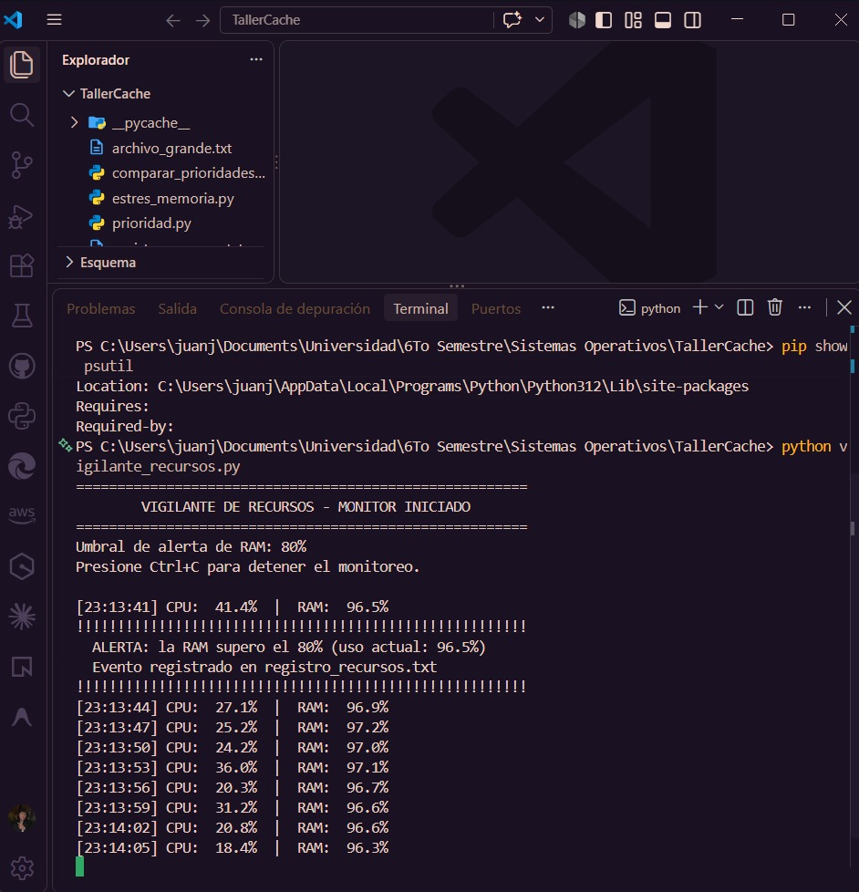

Contenido de `registro_recursos.txt` despues de detener el monitor:


```
Fecha: 2026-10-01 | Hora: 23:13:41 | RAM: 96.5% | CPU: 41.4%
```

---

## Ejercicio 2: Simulador de Memoria Cache

**Objetivo:** ilustrar el principio de la memoria cache: mantener en una memoria rapida los datos usados con frecuencia para evitar accesos repetidos a un almacenamiento mas lento.

> **Aclaracion:** es una **simulacion didactica**. El programa **no mide la cache fisica L1/L2 del procesador**. Un diccionario de Python en RAM hace el papel de la "cache" y el archivo en disco hace el papel del almacenamiento secundario lento.

**Funcionamiento:**

- Si `archivo_grande.txt` no existe, el programa lo genera (unos 50 MB).
- La clase `FileCache` guarda el contenido del archivo en un diccionario cuya clave es la ruta absoluta.
- **CACHE MISS:** la primera solicitud no encuentra el archivo en el diccionario, lo lee del disco con `open()` (`DISCO -> CACHE`) y guarda una copia.
- **CACHE HIT:** las solicitudes siguientes devuelven el contenido directamente desde el diccionario, sin abrir el archivo.
- **Medicion de tiempos:** con `time.perf_counter()` se mide cada lectura. Se cuentan los accesos al disco, los HITS y los MISSES. Despues se repiten 10 lecturas directas del disco y 10 desde la cache para obtener promedios.

**Ejecucion:**

```bash
python simulador_cache.py
```

**Resultados (tomados de la captura real):**

| Medida | Valor |
|---|---|
| Archivo | 52,428,750 bytes (50.00 MB) |
| Lectura 1 (CACHE MISS, disco) | 235.3006 ms |
| Lecturas 2–5 (CACHE HIT) | 0.0596 / 0.0391 / 0.0347 / 0.0199 ms |
| Tiempo promedio desde cache | 0.0383 ms |
| Accesos al disco | 1 |
| CACHE HITS / CACHE MISSES | 4 / 1 |
| Promedio leyendo del disco (10 rep.) | 102.4919 ms |
| Promedio leyendo de cache (10 rep.) | 0.0119 ms |

La primera lectura del disco (235 ms) es mas lenta que el promedio posterior del disco (102 ms), probablemente porque en las lecturas repetidas Windows ya tiene el archivo en su propia cache de archivos en RAM. Aun asi, devolver el objeto que ya esta en memoria es varios ordenes de magnitud mas rapido que volver a leer y decodificar el archivo.

**Evidencias:**

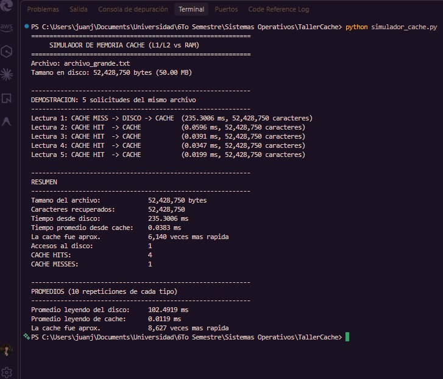

Tamano real de `archivo_grande.txt` comprobado con `Get-Item` (52428750 bytes, igual al que reporta el programa):

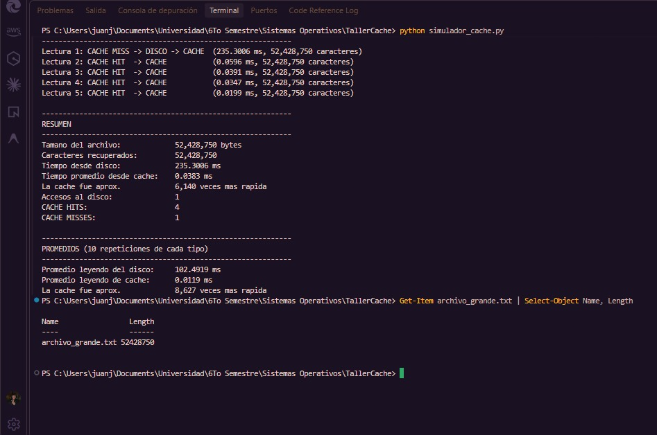

---

## Ejercicio 3: Estres de Memoria y Memoria Virtual

**Objetivo:** generar **presion de memoria de forma controlada** para observar como se comportan la RAM y la memoria virtual (archivo de paginacion) del sistema.

**Conceptos:**

- **Presion de memoria:** situacion en que los procesos piden mas memoria y la RAM disponible se reduce.
- **Memoria virtual:** cada proceso trabaja con un espacio de direcciones virtual. El SO decide que paginas de ese espacio estan en RAM fisica y cuales no.
- **Paginacion / archivo de paginacion:** cuando la RAM escasea, Windows puede mover paginas poco usadas a `pagefile.sys` en disco y traerlas de vuelta cuando se necesitan.

> **Importante:** el programa **no garantiza que Windows use el archivo de paginacion**. Eso depende de Windows, de la RAM disponible, de los demas procesos activos y de las decisiones del administrador de memoria. El programa solo aumenta la demanda de memoria y muestra lo que reporta el sistema.

**Funcionamiento:**

- Agrega a una lista lotes de 10,000 strings de unos 1 KB cada uno (unos 10 MB por paso) cada 0.3 s. Cada string es un objeto nuevo, con un prefijo unico.
- En cada paso muestra la cantidad de elementos, la memoria del proceso (en RAM y comprometida), la RAM del sistema, la memoria disponible y el uso del archivo de paginacion (`psutil.swap_memory()`).
- **Limites de seguridad** (nivel `suave`, el configurado):
  - maximo 512 MB comprometidos por el proceso (y nunca mas del 40 % de la RAM total);
  - maximo 500,000 elementos;
  - se detiene si la RAM del sistema llega al 92 %;
  - se detiene si quedan menos de 500 MB disponibles;
  - pide confirmacion antes de empezar y se puede cancelar con `Ctrl+C`.
- Al alcanzar un limite, mantiene la memoria 15 s para observarla en el **Administrador de tareas -> Rendimiento -> Memoria** y luego la libera (detencion segura, en un bloque `finally`).

**Ejecucion:**

```bash
python estres_memoria.py
```

**Evidencia:**

La captura muestra el crecimiento progresivo de 320,000 a 460,000 elementos (de 364 MB a 513 MB en RAM del proceso), la RAM del sistema entre 88.9 % y 91.9 %, la memoria disponible bajando de 0.87 GB a 0.64 GB y el archivo de paginacion. El llenado se detuvo por el limite de seguridad de 512 MB. Al liberar, el proceso bajo a 23 MB y la RAM del sistema a 85.8 % (1.12 GB disponibles).

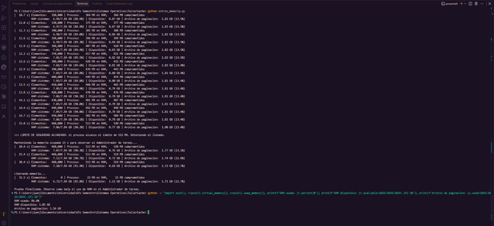

En esta ejecucion el valor reportado del archivo de paginacion **no aumento** (se mantuvo entre 1.71 y 1.83 GB). Es decir, durante esta prueba concreta Windows no mostro, a traves de esta metrica, un traslado adicional de paginas al disco.

**Observacion con el Administrador de tareas** (dos ejecuciones posteriores, distintas de la anterior):

Ejecucion detenida por el **limite de RAM del sistema**: con 110,000 elementos la RAM llego al 92.3 % (limite 92 %) y el programa detuvo el llenado. El Administrador de tareas muestra la memoria al 92 % y el proceso `Python` con 130.6 MB.


Ejecucion en la fase de mantenimiento y liberacion: con 380,000 elementos (428 MB en RAM) la RAM del sistema estuvo entre 91.8 % y 92.7 %. Al liberar, el proceso bajo a 23 MB y la RAM del sistema a 89.2 %. El Administrador de tareas, capturado despues de la liberacion, muestra la memoria al 90 %. En ambas ejecuciones el archivo de paginacion reportado se mantuvo entre 1.71 y 1.79 GB.

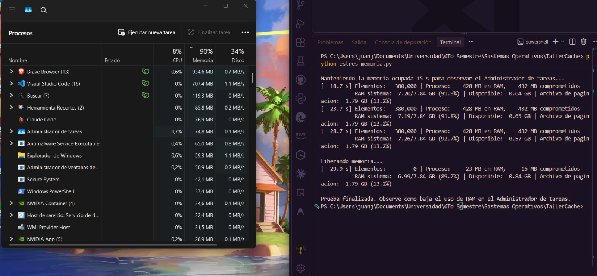

---

## Ejercicio 4: Prioridad de Procesos (Scheduling)

**Objetivo:** observar como la **prioridad** asignada a un proceso influye en el **planificador (scheduler)** de Windows cuando varios procesos compiten por la CPU.

**Conceptos:**

- **Scheduling:** el SO decide que hilo se ejecuta en cada nucleo y durante cuanto tiempo. Entre hilos listos, Windows favorece a los de mayor prioridad.
- **Prioridad:** se cambia la clase de prioridad del proceso con `psutil.Process().nice(...)`.
  - **LOW:** el programa la solicita como `BELOW_NORMAL_PRIORITY_CLASS` (por eso la "prioridad aplicada" aparece como `BELOW_NORMAL`).
  - **HIGH:** `HIGH_PRIORITY_CLASS`.
- **Afinidad:** con `cpu_affinity([0])` se fijan ambos procesos al mismo nucleo para que realmente compitan por el. Con `--sin-afinidad`, Windows reparte los procesos entre los 8 nucleos logicos.
- **Tiempo de CPU:** tiempo que el proceso estuvo realmente ejecutandose (user + system).
- **Tiempo de retorno:** tiempo desde la salida comun de ambos procesos hasta que cada uno termina. Incluye el tiempo que el proceso estuvo esperando la CPU.

**Funcionamiento:**

- `prioridad.py` ejecuta un calculo intensivo de CPU (contar los primos menores que 1,500,000) en un solo proceso con la prioridad indicada y guarda el resultado en el CSV.
- `comparar_prioridades.py` lanza dos procesos simultaneos con el mismo calculo (A = LOW, B = HIGH), sincronizados con una `Barrier`, durante 3 rondas en las que alterna el orden de lanzamiento. Muestra PID, prioridad pedida y aplicada, afinidad, horas, duracion, tiempo de CPU y tiempo de retorno, y al final un resumen. Todo se agrega a `resultados_prioridad.csv`.

**Ejecucion:**

```bash
python prioridad.py low
python prioridad.py high
python comparar_prioridades.py
python comparar_prioridades.py --sin-afinidad
```

> **REALTIME no fue ejecutado experimentalmente.** `prioridad.py` admite `realtime`, pero exige confirmacion explicita porque puede bloquear el sistema, y `comparar_prioridades.py` lo rechaza.

### Resultados (de `resultados_prioridad.csv`)

El CSV contiene **dos series** de pruebas comparativas. Los promedios se calcularon a partir de las filas del CSV.

**Serie 1 (22:59–23:00), filas 2–13:**

| Configuracion | Retorno LOW (promedio) | Retorno HIGH (promedio) | Tiempo de CPU |
|---|---|---|---|
| Mismo nucleo `[0]` | 9.783 s (10.186, 9.626, 9.537) | 4.806 s (4.862, 4.791, 4.764) | 4.67–4.94 s |
| Sin afinidad | 5.236 s (5.392, 5.170, 5.147) | 5.195 s (5.383, 5.085, 5.116) | 5.06–5.36 s |

**Serie 2 (23:26–23:28), filas 14–25, que corresponde a las capturas:**

| Configuracion | Retorno LOW (promedio) | Retorno HIGH (promedio) | Tiempo de CPU |
|---|---|---|---|
| Mismo nucleo `[0]` | 11.998 s (13.515, 11.228, 11.252) | 6.001 s (6.313, 5.794, 5.895) | 5.28–6.55 s |
| Sin afinidad | 8.010 s (8.260, 8.093, 7.676) | 7.807 s (7.997, 7.829, 7.596) | 7.45–7.95 s |

En las 12 rondas **HIGH termino primero**. Los tiempos absolutos de la serie 2 son mayores que los de la serie 1, posiblemente por una mayor carga del equipo en ese momento (a las 23:13 el ejercicio 1 registro la RAM en 96.5 %). La tendencia, sin embargo, es la misma en ambas series.

**Ejecucion individual (`prioridad.py`), filas 26–27 del CSV:** un solo proceso, sin competir con otro, con afinidad libre `[0, 1, 2, 3, 4, 5, 6, 7]`.

| Prioridad pedida | Aplicada | PID | Duracion real | Tiempo de CPU |
|---|---|---|---|---|
| LOW | BELOW_NORMAL | 8020 | 6.401 s | 6.297 s |
| HIGH | HIGH | 15588 | 6.115 s | 6.125 s |

En la ejecucion individual la columna `turnaround_seconds` queda vacia en el CSV, porque el tiempo de retorno solo se calcula en la comparacion simultanea. Sin otro proceso compitiendo, la duracion real es practicamente igual al tiempo de CPU con ambas prioridades.

### Evidencias

Ejecucion individual con prioridad LOW:

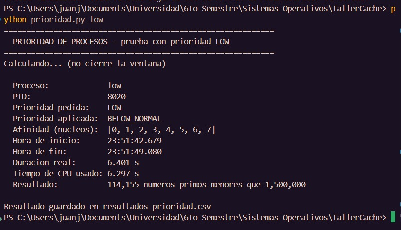

Ejecucion individual con prioridad HIGH:

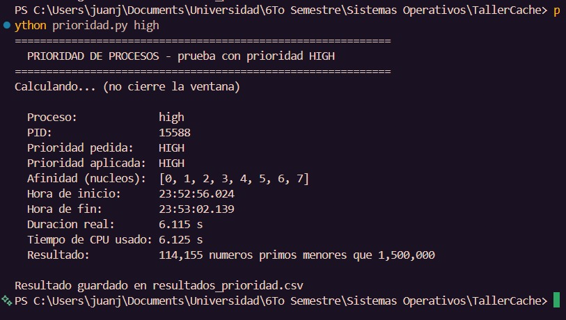

Comparacion con afinidad al mismo nucleo (rondas 1 y 2). Se ve LOW -> `BELOW_NORMAL`, HIGH -> `HIGH`, afinidad `[0]`, PID, tiempos de CPU y de retorno:

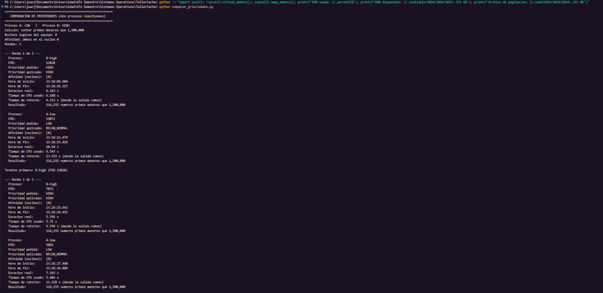

Comparacion sin afinidad (rondas 1 y 2), afinidad `[0, 1, 2, 3, 4, 5, 6, 7]`:

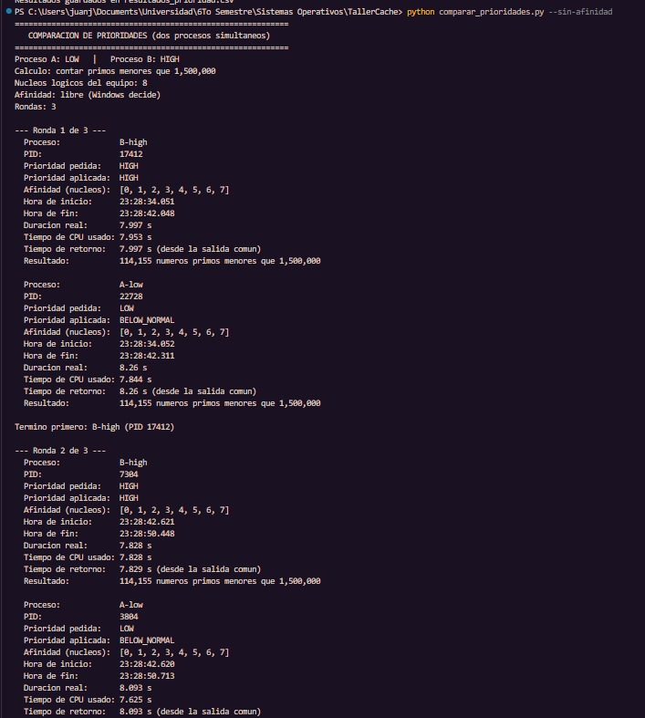

Contenido de `resultados_prioridad.csv` con las 24 filas de ambas series (la captura es anterior a las dos filas de la ejecucion individual):

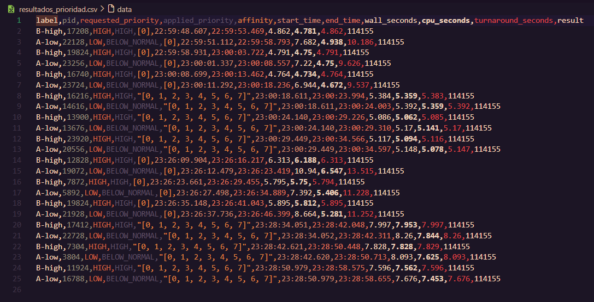

Capturas adicionales con la ronda 3 y el resumen final de cada comparacion:

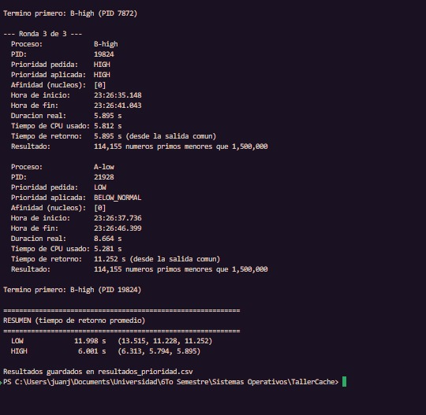

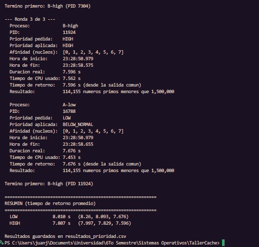

---

## Conclusiones

1. **Ejercicio 1:** con `psutil` es posible leer desde el codigo el estado de los recursos que administra el SO. En la prueba la RAM ya estaba en 96.5 %, por encima del umbral del 80 %. Se genero la alerta y quedo una unica linea en `registro_recursos.txt`, porque el programa registra el episodio y no cada lectura.

2. **Ejercicio 2:** los datos guardados en la estructura de memoria se reutilizan sin volver a leer el archivo. Hubo 1 acceso al disco para 5 solicitudes (1 MISS, 4 HITS). Las lecturas desde la cache tardaron centesimas de milisegundo, frente a cientos de milisegundos desde el disco. Es una analogia del principio de localidad que aprovechan las caches reales, no una medicion de la cache L1/L2.

3. **Ejercicio 3:** el programa genera presion de memoria de forma controlada. El consumo crecio de manera progresiva y el llenado se detuvo por el limite de 512 MB antes de comprometer el sistema. Al liberar la lista, la memoria del proceso volvio a unos 23 MB. En esta ejecucion el archivo de paginacion no mostro un aumento. Su uso depende de Windows y del estado del sistema, no solo del programa.

4. **Ejercicio 4:** la prioridad tiene mayor efecto cuando varios procesos compiten por el **mismo nucleo**. Con afinidad `[0]`, HIGH termino en aproximadamente la mitad del tiempo de retorno de LOW (4.81 s frente a 9.78 s en la serie 1, y 6.00 s frente a 12.00 s en la serie 2), aunque ambos usaron un tiempo de CPU similar. LOW no trabajo mas, sino que espero mas. **Con nucleos disponibles la diferencia casi desaparece** (5.20 s frente a 5.24 s, y 7.81 s frente a 8.01 s), porque cada proceso obtiene su propio nucleo y el scheduler casi no tiene que elegir entre ellos.

---

## Tabla de evidencias

| Archivo | Ejercicio | Que demuestra |
|---|---|---|
| [01_vigilante_recursos.png](evidencias/01_vigilante_recursos.png) | 1 | Monitor activo con CPU y RAM, umbral del 80 %, alerta con RAM en 96.5 % y aviso de registro en el TXT |
| [02_registro_recursos.png](evidencias/02_registro_recursos.png) | 1 | Contenido de `registro_recursos.txt` con la alerta registrada (fecha, hora, RAM, CPU) |
| [03_simulador_cache.png](evidencias/03_simulador_cache.png) | 2 | CACHE MISS (DISCO -> CACHE), 4 CACHE HIT, tiempos, accesos al disco y promedios de 10 repeticiones |
| [04_archivo_cache.png](evidencias/04_archivo_cache.png) | 2 | Tamano real de `archivo_grande.txt` (52428750 bytes), que coincide con el del simulador |
| [05_estres_memoria.png](evidencias/05_estres_memoria.png) | 3 | Crecimiento progresivo de memoria, RAM, disponible, archivo de paginacion, limite de 512 MB y liberacion |
| [06_comparacion_prioridades.png](evidencias/06_comparacion_prioridades.png) | 4 | LOW vs HIGH en el mismo nucleo (rondas 1–2): PID, prioridades, afinidad, CPU, retorno |
| [07_comparacion_sin_afinidad.png](evidencias/07_comparacion_sin_afinidad.png) | 4 | LOW vs HIGH sin afinidad (rondas 1–2) |
| [08_resultados_prioridad.png](evidencias/08_resultados_prioridad.png) | 4 | Contenido de `resultados_prioridad.csv` (24 filas, dos series) |
| [09_estres_memoria_administrador_tareas_limite_ram.png](evidencias/09_estres_memoria_administrador_tareas_limite_ram.png) | 3 | Administrador de tareas (memoria al 92 %, proceso Python) junto a la consola. Llenado detenido por el limite de RAM del 92 % |
| [10_estres_memoria_administrador_tareas_liberacion.png](evidencias/10_estres_memoria_administrador_tareas_liberacion.png) | 3 | Administrador de tareas junto a la consola: mantenimiento de 15 s, liberacion (proceso a 23 MB) y fin de la prueba |
| [11_prioridad_low.png](evidencias/11_prioridad_low.png) | 4 | `prioridad.py low`: un proceso, LOW -> BELOW_NORMAL, PID 8020, 6.401 s reales y 6.297 s de CPU |
| [12_prioridad_high.png](evidencias/12_prioridad_high.png) | 4 | `prioridad.py high`: un proceso, HIGH -> HIGH, PID 15588, 6.115 s reales y 6.125 s de CPU |
| [adicional/06b_comparacion_prioridades_ronda3_resumen.png](evidencias/adicional/06b_comparacion_prioridades_ronda3_resumen.png) | 4 | Mismo nucleo: ronda 3 y resumen (LOW 11.998 s, HIGH 6.001 s) |
| [adicional/07b_comparacion_sin_afinidad_ronda3_resumen.png](evidencias/adicional/07b_comparacion_sin_afinidad_ronda3_resumen.png) | 4 | Sin afinidad: ronda 3 y resumen (LOW 8.010 s, HIGH 7.807 s) |

### Notas sobre las evidencias

- **Ejercicio 3:** las capturas 05, 09 y 10 corresponden a tres ejecuciones distintas. Ninguna muestra la advertencia inicial ni la confirmacion para comenzar.
- **Ejercicio 4:** la captura 08 del CSV es anterior a las ejecuciones individuales. Las filas de `prioridad.py low/high` estan en el archivo `resultados_prioridad.csv` del repositorio.
